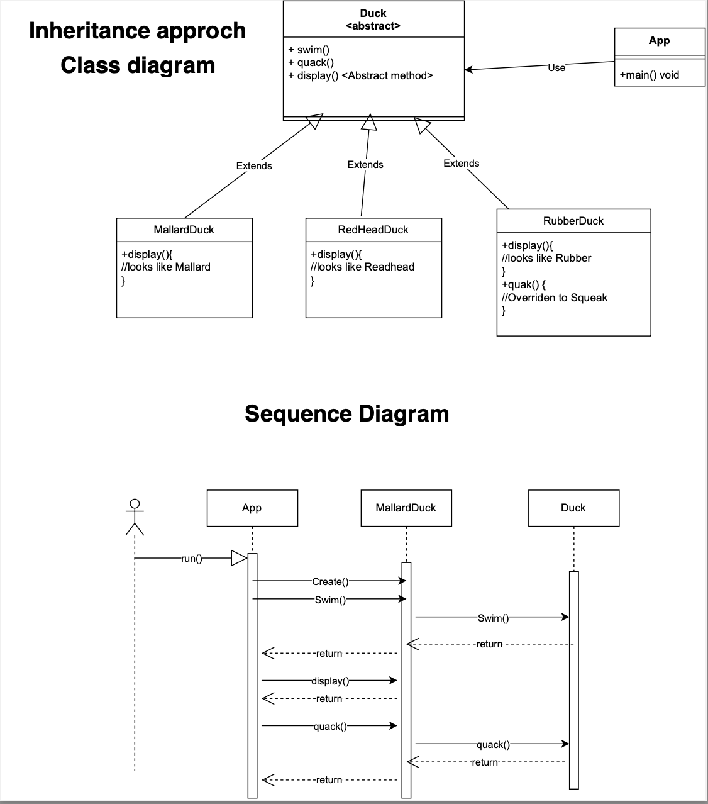
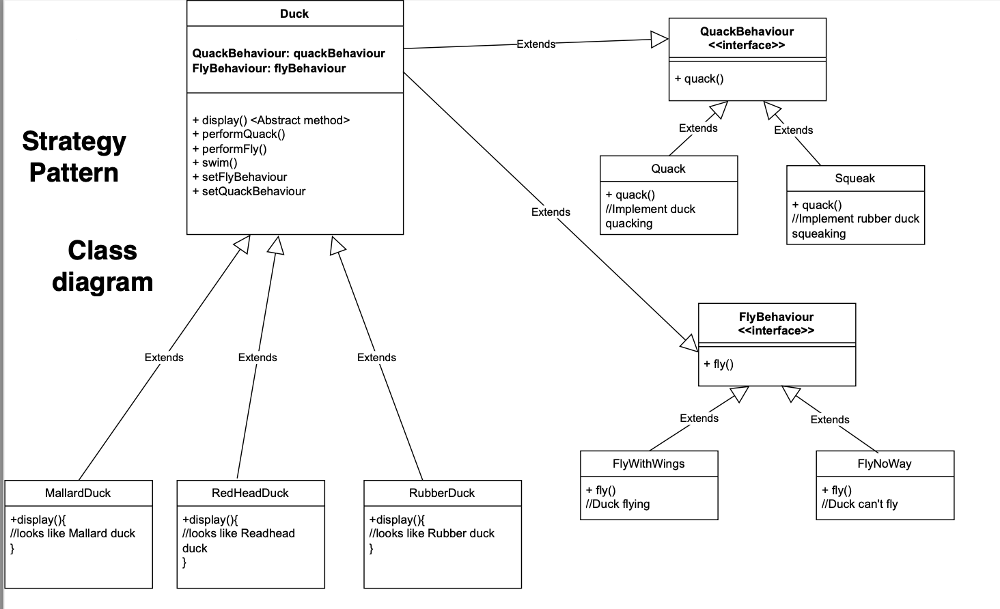
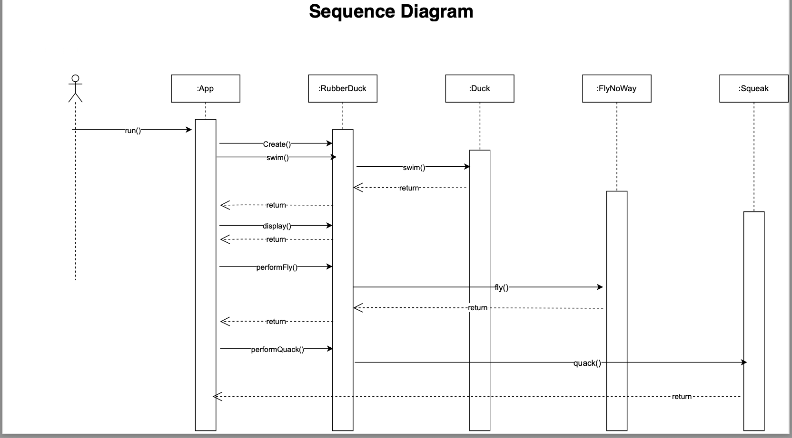

# Strategy Design Pattern

This project demonstrates the Strategy Design Pattern implemented using a duck simulation. Different types of ducks are modeled, each having a unique flying behavior. The Strategy Design Pattern allows the behavior of a duck to be changed at runtime, making the system flexible and extensible.

## Introduction

In this project, we implement a simple duck simulation using the Strategy Design Pattern. The ducks exhibit different flying behaviors, such as flying with wings, flying no way (immobile), and flying with rocket power. These behaviors are modeled using the Strategy Design Pattern, where each flying behavior is encapsulated in its own class, and the behavior can be dynamically assigned to different duck objects.

### Key Features:
- **Strategy Pattern**: The `FlyBehavior` interface defines different flying behaviors, such as `FlyNoWay`, `FlyWithWings`, and `FlyRocketPowered`.
- **Duck Types**: There are multiple duck classes (`MallardDuck`, `RedheadDuck`, `RubberDuck`), each of which can have different flying behaviors.
- **Flexible Behavior Assignment**: The behavior of a duck can be changed dynamically by setting a different flying strategy.






## Table of Contents

1. [Installation](#installation)
2. [Usage](#usage)
3. [Features](#features)
4. [Contributing](#contributing)
5. [License](#license)
6. [Contact Information](#contact-information)
7. [Acknowledgements](#acknowledgements)

## Installation

To set up and run the project, follow these steps:

1. **Clone the repository**:
    ```bash
    git clone https://github.com/rishu-8104/Strategy-Design-Pattern.git
    cd strategy-design-pattern-java
    ```

2. **Install dependencies**:
   This project uses Maven to manage dependencies.

   - If Maven is not installed, download and install it from the [official Maven website](https://maven.apache.org/download.cgi).

3. **Build the project**:
    ```bash
    mvn clean install
    ```

4. **Run the project**:
    After building the project, run the application using:
    ```bash
    mvn exec:java -Dexec.mainClass="my.ducks.project.Main"
    ```

5. **Access the application**:
    The output will be displayed in the terminal.

## Usage

Here’s an example of how to use the Strategy Design Pattern to simulate ducks with different flying behaviors:

```java
public class Main {
    public static void main(String[] args) {
        // Create duck instances with different flying behaviors
        Duck mallardDuck = new MallardDuck();
        Duck rubberDuck = new RubberDuck();
        Duck redheadDuck = new RedheadDuck();

        // Display behaviors
        mallardDuck.performFly();
        rubberDuck.performFly();
        redheadDuck.performFly();

        // Change behavior dynamically at runtime
        mallardDuck.setFlyBehavior(new FlyRocketPowered());
        mallardDuck.performFly();
    }
}
```

### Expected Output:

```
Mallard Duck is flying with wings!
Rubber Duck can't fly!
Redhead Duck is flying with wings!
Mallard Duck is flying with rocket power!
```

## Features

- **Duck Types**:
  - `MallardDuck`: A duck that can fly with wings.
  - `RedheadDuck`: A duck that can fly with wings.
  - `RubberDuck`: A duck that cannot fly.

- **Flying Behaviors**:
  - `FlyWithWings`: A flying behavior where the duck can fly with wings.
  - `FlyNoWay`: A flying behavior where the duck cannot fly.
  - `FlyRocketPowered`: A flying behavior where the duck flies using rocket power.

- **Strategy Pattern**:
  - The `FlyBehavior` interface defines the `fly()` method, which is implemented by different flying behavior classes. Ducks can change their flying behavior dynamically by setting different `FlyBehavior` implementations.

## Contributing

We welcome contributions to improve this project. If you want to contribute, please follow these steps:

1. Fork the repository.
2. Create a new branch (`git checkout -b feature-branch`).
3. Make your changes.
4. Commit your changes (`git commit -am 'Add new feature'`).
5. Push to your branch (`git push origin feature-branch`).
6. Create a pull request.

### Guidelines:
- Follow the existing code style.
- Write tests for any new features or bug fixes.
- Ensure the project builds successfully with `mvn clean install`.

## License

This project is licensed under the MIT License - see the [LICENSE](LICENSE) file for details.

## Contact Information

For any questions or feedback, feel free to reach out:

- **Email**: rishugupta8104@gmail.com

## Acknowledgements

- **Design Patterns**: Implementing the Strategy Design Pattern to provide flexibility in behavior selection.
- **Maven**: For managing project dependencies and building the project.
